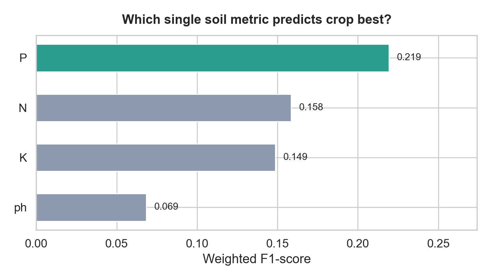

<div align="center">

# 🌱 Crop Feature Selection ML

**Identify the single most predictive soil metric for crop recommendation — helping farmers make data-driven decisions under budget constraints.**

[](https://github.com/eddieoz/crop-feature-selection-ml/actions)
[](https://www.python.org/)
[](https://scikit-learn.org/)
[](LICENSE)
[](https://github.com/psf/black)

</div>

---

## 🧾 What this project means 

If you can only afford **one** soil lab test, this project answers:

- **Which single soil measurement (N, P, K, or pH) gives the best signal** to recommend a crop?

It trains a simple model *four times* (once per feature), compares their scores, and recommends the **one measurement** that performs best on the dataset.

### Quick visuals (generated by this repo)

Run:

```bash
python -m src.generate_assets
```

Then check:

- **Single-feature score comparison**: `assets/03_single_feature_scores.png`
- **Crop class distribution**: `assets/01_crop_class_distribution.png`
- **Soil feature distributions**: `assets/02_feature_distributions.png`



### Mini glossary

- **Feature**: an input measurement (e.g., `K` = potassium).
- **Target / label**: what we’re predicting (the `crop`).
- **Model**: a function that learns patterns from examples and makes predictions.
- **Train / test split**: we train on one part of the data and evaluate on unseen rows.
- **Weighted F1-score**: a single “how good is it?” number that accounts for class imbalance (some crops appear more than others).

## 📌 Problem Statement

A farmer wants to grow the optimal crop for their land, but can only afford to measure **one** soil property due to lab costs. The four candidate measurements are:

| Feature | Description | Unit |
|---------|-------------|------|
| **N** | Nitrogen content | mg/kg |
| **P** | Phosphorous content | mg/kg |
| **K** | Potassium content | mg/kg |
| **ph** | Soil acidity/alkalinity | pH scale (0–14) |

**Objective:** Use machine learning to determine which single feature gives a model the highest predictive accuracy for crop type.

---

## 🧠 Approach

1. Load and explore the `soil_measures.csv` dataset
2. Split data (80 / 20) with **stratification** to preserve class balance
3. Train a **Multinomial Logistic Regression** per feature (one at a time)
4. Evaluate each model using the **weighted F1-score**
5. Select the feature with the highest F1-score as the recommended measurement

### Why Logistic Regression?

- Interpretable baseline model ideal for single-feature comparison
- Multinomial variant natively handles multi-class crop labels
- Fast to train — enables rapid iteration across features

---

## 📊 Results

| Feature | Weighted F1-Score |
|---------|:-----------------:|
| **(varies by dataset)** | **best** |
| N (Nitrogen) | — |
| P (Phosphorous) | — |
| ph (pH) | — |

> Run the notebook or script to see exact scores on your data.

**Key insight:** Even a single soil measurement can meaningfully predict the best crop — no expensive full-panel lab analysis required.

---

## 📁 Project Structure

```
crop-feature-selection-ml/
│
├── data/
│   ├── soil_measures.csv          # Dataset (N, P, K, ph, crop)
│   └── generate_sample_data.py    # Script to regenerate synthetic data
│
├── notebook/
│   └── crop_feature_selection.ipynb  # Full EDA + modelling + visualisations
│
├── src/
│   └── feature_selection.py       # Reusable module & CLI entry point
│
├── tests/
│   └── test_feature_selection.py  # Pytest unit tests
│
├── .github/
│   └── workflows/
│       └── ci.yml                 # GitHub Actions CI (Python 3.10–3.12)
│
├── .gitignore
├── LICENSE                        # MIT
├── README.md
└── requirements.txt
```

---

## 🚀 Quick Start

### 1. Clone & install

```bash
git clone https://github.com/GeekKwame/crop-feature-selection-ml.git
cd crop-feature-selection-ml
pip install -r requirements.txt
```

### (Beginner-friendly) Run the “Farmer Mode” demo app

This launches a simple web app (no ML knowledge needed): you pick **one** soil metric, type your value, and it shows the **top 3 crop recommendations** plus a plain-English explanation.

```bash
# Ensure you have a dataset (or generate the included synthetic one)
python data/generate_sample_data.py

# Launch the app
python -m streamlit run app.py
```

### Generate shareable charts (PNG)

This creates a few easy-to-share visuals in `assets/` (class distribution, feature distributions, and single-feature score comparison).

```bash
python -m src.generate_assets
```

### 2. Run the standalone script

```bash
python src/feature_selection.py
# Optional: specify a custom data path or features
python src/feature_selection.py --data data/soil_measures.csv --features N P K ph
```

### 3. Explore the notebook

```bash
jupyter notebook notebook/crop_feature_selection.ipynb
```

### 4. Run tests

```bash
python -m pytest tests/ -v
```

---

## 🧪 Tech Stack

| Tool | Purpose |
|------|---------|
| [pandas](https://pandas.pydata.org/) | Data loading & manipulation |
| [scikit-learn](https://scikit-learn.org/) | Logistic Regression, train/test split, metrics |
| [matplotlib](https://matplotlib.org/) | Result visualisation |
| [seaborn](https://seaborn.pydata.org/) | Statistical plots & EDA |
| [streamlit](https://streamlit.io/) | Beginner-friendly interactive demo app |
| [pytest](https://pytest.org/) | Unit testing |
| [GitHub Actions](https://github.com/features/actions) | Continuous integration |

---

## 📂 Dataset

The dataset (`soil_measures.csv`) contains soil measurements paired with the recommended crop label. It is based on the publicly available [Crop Recommendation Dataset](https://www.kaggle.com/datasets/atharvaingle/crop-recommendation-dataset) on Kaggle.

If you do not have the original file, regenerate a synthetic version with realistic distributions:

```bash
python data/generate_sample_data.py
```

**Schema:**

| Column | Type | Description |
|--------|------|-------------|
| N | float | Nitrogen content ratio |
| P | float | Phosphorous content ratio |
| K | float | Potassium content ratio |
| ph | float | Soil pH value |
| crop | string | Target crop label (22 classes) |

---

## 🤝 Contributing

Contributions are welcome! Please:

1. Fork the repository
2. Create a feature branch: `git checkout -b feature/your-feature`
3. Commit your changes: `git commit -m 'Add your feature'`
4. Push to the branch: `git push origin feature/your-feature`
5. Open a Pull Request

Please make sure all tests pass before submitting a PR:
```bash
python -m pytest tests/ -v
```

---

## 📄 License

This project is licensed under the **MIT License** — see [LICENSE](LICENSE) for details.

---

<div align="center">

Made with ❤️ and 🌱 | If this helped you, please ⭐ the repo!

</div>
